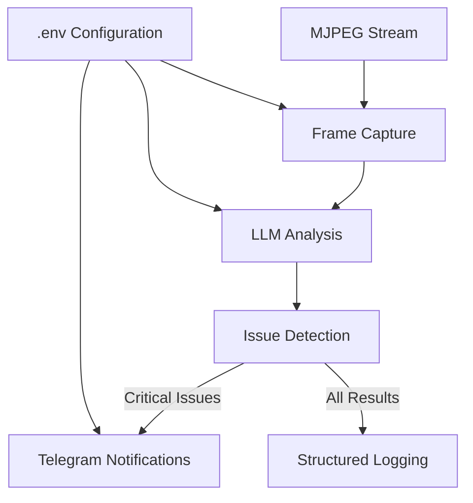

# Elegoo Centauri Carbon Print Monitor

An LLM-based real-time print monitoring system for Elegoo Centauri Carbon 3D printers. Uses computer vision and language models to detect print anomalies and send Telegram notifications.

## Features

- **Real-time Monitoring**: Captures frames from MJPEG stream every 10 seconds (configurable)
- **AI-Powered Analysis**: Uses vision language models (smolvlm2-2.2b-instruct, qwen/qwen3-vl-4b, qwen/qwen3-vl-8b) via LM Studio
- **Anomaly Detection**: Identifies print issues with bounding boxes and confidence scores
- **Image Annotation**: Automatic bounding box annotations (red for problems, green for objects)
- **Telegram Notifications**: Sends alerts with annotated images when issues are detected
- **Interactive Commands**: Telegram bot responds to commands just like console client
- **Configurable Alert Levels**: Control when automatic notifications are sent (all, warning, critical, none)
- **Console Interactive Mode**: Command-line interface with status, capture, and analyze commands
- **Printer Status Integration**: Real-time printer job status via SDCP WebSocket API
- **Smart Status Change Detection**: Only notifies when printer machine status actually changes (Idle → Printing, etc.)
- **Automatic Image Cleanup**: Cleans up old images (>1 hour) every 30 minutes to prevent disk space issues
- **Configurable**: All settings via environment variables
- **Robust Error Handling**: Retry logic and graceful degradation

## System Architecture



## Quick Start

### Prerequisites
- Node.js v18 or higher
- LM Studio with smolvlm2-2.2b-instruct model
- Telegram Bot (created via @BotFather) - Optional
- Elegoo Centauri Carbon printer with MJPEG stream enabled

### Installation

1. **Clone and setup**
```bash
git clone <repository-url>
cd elegooPrintMon
npm install
```

2. **Configure environment**
```bash
cp .env.example .env
# Edit .env with your settings
```

3. **Start LM Studio**
- Launch LM Studio
- Load smolvlm2-2.2b-instruct model
- Start server on port 1234 (or update OPENAI_URL in .env)

4. **Run the monitor**

**Standard mode (background monitoring):**
```bash
npm start
```

**Console mode (interactive with commands):**
```bash
npm start -- --console
# or
node src/index.js --console
```

## Configuration

### Optional: Setting Up Telegram Bot (for notifications)

If you want to receive Telegram notifications for print issues:

1. **Create a new bot**:
   - Open Telegram and search for `@BotFather`
   - Send `/newbot` command
   - Follow prompts to choose a name and username for your bot
   - Save the **bot token** provided by BotFather (looks like `1234567890:ABCdefGHIjklMNOpqrsTUVwxyz`)

2. **Get your Chat ID**:
   - Start a conversation with your new bot
   - Send any message to the bot
   - Visit `https://api.telegram.org/bot<YOUR_BOT_TOKEN>/getUpdates`
   - Look for `"chat":{"id":<YOUR_CHAT_ID>}` in the response
   - Save the **chat ID** (a number, may be negative for groups)

3. **Optional: Configure bot permissions**:
   - Use `/setprivacy` in BotFather to disable privacy mode if needed
   - This allows the bot to see messages in groups/channels

**Note**: Telegram is optional. If credentials are not provided, the app will run in logging-only mode and warn about missing notification configuration.

### Create `.env` file with the following settings:

```env
# Printer Configuration
MJPEG_STREAM_URL=http://192.168.10.179:3031/video
FRAME_CAPTURE_INTERVAL=10000
PRINTER_IP=192.168.10.179

# LLM Configuration (LM Studio)
OPENAI_URL=http://localhost:1234/v1
OPENAI_TOKEN=your-lm-studio-token
LLM_MODEL=smolvlm2-2.2b-instruct
LLM_MODE=enabled  # 'enabled' for AI analysis, 'disabled' for frame capture only

# Telegram Configuration (from steps above)
TELEGRAM_BOT_TOKEN=your-bot-token-from-botfather
TELEGRAM_CHAT_ID=your-chat-id-from-getupdates
NOTIFICATION_THRESHOLD=0.8
TELEGRAM_ALERT_LEVEL=critical

# Application Settings
LOG_LEVEL=info
MAX_RETRIES=3
RETRY_DELAY=5000
LLM_COOLDOWN_SECONDS=10
```

## Project Structure

```
elegooPrintMon/
├── src/
│   ├── index.js              # Main application entry point
│   ├── config/               # Configuration management
│   ├── capture/              # MJPEG frame capture
│   ├── llm/                  # LLM integration and prompts
│   ├── analysis/             # Print analysis logic
│   ├── notifications/        # Telegram notification system
│   ├── printer/              # Printer status and discovery
│   └── utils/                # Utilities and logging
│       ├── image-cleanup.js  # Automatic image cleanup
│       ├── logger.js         # Logging utilities
│       └── image-annotator.js # Image annotation
├── images/                   # Captured and annotated images
├── tests/                    # Test files
├── logs/                     # Application logs
├── plans/                    # Planning and architecture documents
├── .env                      # Environment configuration
├── .env.example              # Example configuration
└── package.json
```

## How It Works

1. **Frame Capture**: The system connects to the printer's MJPEG stream and captures frames at configured intervals
2. **LLM Analysis**: Each frame is sent to LM Studio with a specialized prompt for 3D print analysis (if LLM_MODE=enabled)
3. **Issue Detection**: The LLM returns structured JSON identifying objects and potential problems
4. **Notification**: If problems exceed the confidence threshold, alerts are sent to console and optionally Telegram
5. **Logging**: All analysis results are logged for monitoring and debugging

### LLM Mode Configuration

The system supports two operating modes via the `LLM_MODE` environment variable:

#### **`LLM_MODE=enabled` (Default)**
- Full AI-powered analysis with LM Studio
- Each frame is analyzed by vision language model
- Detects objects and printing issues with confidence scores
- Sends alerts based on configurable thresholds
- Provides annotated images with bounding boxes

#### **`LLM_MODE=disabled`**
- Lightweight frame capture only mode
- No LLM analysis or AI processing
- Captures frames and monitors printer status changes
- Still supports Telegram and console commands
- **Smart Status Change Detection**: Only sends notifications when printer machine status changes (Idle → Printing, Printing → Paused, etc.)
- **Automatic Image Cleanup**: Cleans up old images (>1 hour) every 30 minutes
- Useful when:
  - LM Studio is not available
  - You want to reduce system resource usage
  - You only need visual monitoring without AI analysis
  - Testing printer connectivity and frame capture

**Example usage with LLM disabled:**
```bash
# In .env file
LLM_MODE=disabled

# Run the system
npm start
```

In disabled mode, the system will:
- Capture frames at configured intervals
- **Monitor printer machine status** (sampled every frame)
- **Send notifications only when machine status changes** (Idle → Printing, Printing → Paused, etc.)
- **Respect 1-minute cooldown** between status change notifications to prevent spam
- Display regular frames in console only (no Telegram spam)
- Save captured images to disk
- Respond to `/status`, `/capture`, and `/analyze` commands (without AI analysis)
- **Allow user-requested status** via Telegram `/status` command or console

**Status Change Detection:**
The system only detects and notifies on **machine status changes**:
- **Machine status changes** (Idle → Printing, Printing → Paused, etc.)
- **First valid status** after startup or connection
- **Invalid status** (connection errors, printer offline)

**Note**: The system does NOT notify on:
- Print status changes (Printing → Completed, etc.)
- Filename changes (print job started/ended)
- Progress changes or milestones
- Temperature or position changes

**Smart Detection Logic:**
- Uses loose equality comparison to handle type differences (number vs string)
- Tracks whether valid status has ever been received to prevent false positives
- Only notifies once per actual status change, not repeatedly during connection issues

**Example Status Change Notifications:**
```
🔄 Printer Status Changed: Machine Status Updated
🖨️ Elegoo Centauri Carbon
📋 Machine: Idle → Printing
🖨️ Print: Printing (45% complete)
📄 File: calibration_cube.gcode
⏱️ Time remaining: 2h 15m
🌡️ Temperatures: Nozzle 210°C, Bed 60°C
📸 Frame captured and attached
```

## Console Mode

When running with `--console` flag, the system enters interactive mode with these commands:

### Available Commands:
- **`status` or `/status`** - Capture current frame, save image, and show AI analysis
- **`capture` or `/capture`** - Capture and save current frame to images/ directory
- **`analyze` or `/analyze`** - Capture, save, and show detailed AI analysis
- **`help` or `/help`** - Show available commands
- **`exit` or `quit`** - Exit console mode

### Console Mode Features:
- **Interactive command interface** - Type commands like in a chat
- **Image saving** - All captured frames are saved to `images/` directory
- **Real-time alerts** - Automatic alerts display in console with problem details
- **Status commands** - Get current print status with AI analysis
- **Visual feedback** - Color-coded output and progress indicators

### Example Console Session:
```
print-monitor> status
📊 Status Command Received
Capturing current frame...
📸 Status image saved: /path/to/images/status_1_2026-01-25T19-42-10-652Z.jpg
🤖 Analyzing with AI...

=== AI Analysis Results ===
Image: /path/to/images/status_1_2026-01-25T19-42-10-652Z.jpg
Overall Status: GOOD

👀 Objects Detected:
1. Print head moving across bed (95%)
2. Completed print layers (88%)

✅ No problems detected

print-monitor>
```

## Telegram Bot Commands

When Telegram notifications are enabled, the bot can respond to commands just like the console client. This allows remote monitoring and control via Telegram.

### Available Telegram Commands:
- **`/status`** - Capture current frame, save image, and send AI analysis summary
- **`/capture`** - Capture and send current frame image
- **`/analyze`** - Capture, save, and send detailed AI analysis
- **`/help`** - Show available commands
- **`/alertlevel <level>`** - Configure automatic notification level (all, warning, critical, none)

### Telegram Bot Features:
- **Interactive command interface** - Send commands directly to the bot
- **Image annotations** - All images sent include bounding box annotations (red for problems, green for objects)
- **Configurable alert levels** - Control when automatic notifications are sent
- **Remote monitoring** - Monitor prints from anywhere with Telegram access

### Alert Level Configuration:
The system supports configurable alert levels for automatic notifications:

- **`all`** - Send notifications for all statuses (good, warning, critical, error)
- **`warning`** - Send notifications for warning, critical, and error statuses
- **`critical`** - Send notifications only for critical and error statuses (default)
- **`none`** - Disable all automatic notifications (only respond to commands)

Configure via `.env`:
```env
TELEGRAM_ALERT_LEVEL=critical
```

Or change dynamically via Telegram command:
```
/alertlevel warning
```

### Example Telegram Interaction:
```
User: /status
Bot: 📊 Status Command Received
     Capturing current frame...
     🤖 Analyzing with AI...
     
     === AI Analysis Results ===
     Overall Status: WARNING
     
     👀 Objects Detected:
     1. Print head moving across bed (95%)
     2. Completed print layers (88%)
     
     ⚠️ Problems Detected:
     1. Layer shifting (85%)
     
     🖨️ Printer Status:
     Elegoo Centauri Carbon
     IP: 192.168.10.179
     Status: Printing
     Progress: 45%
     Time remaining: 2h 15m
     Temperatures: Nozzle 210°C, Bed 60°C
     
     � Annotated image attached
```

## Printer Status Integration

The system now includes direct printer status monitoring via the Elegoo SDCP WebSocket API. This provides real-time printer job status alongside AI analysis.

### Features:
- **Real-time Printer Status**: Get current print job status, progress, and temperatures
- **Network Discovery**: Automatically discover printers on your local network
- **Command Integration**: `/status` command now shows both AI analysis and printer status
- **Modular Design**: Separate modules for discovery and status retrieval

### Configuration:
Add printer IP to your `.env` file:
```env
# Printer Configuration
PRINTER_IP=192.168.10.179
```

### Status Command Output:
The `/status` command now provides comprehensive information:

1. **AI Analysis**: Visual analysis of current print frame
2. **Printer Status**: Real-time printer job information including:
   - Machine status (idle, printing, paused, error)
   - Print progress and time remaining
   - Current temperatures (nozzle, bed)
   - Print filename and layer information
   - Build plate position and speed

### Example Console Status Output:
```
=== AI Analysis Results ===
Overall Status: GOOD
Objects Detected: 2
Problems Detected: 0

=== Printer Status ===
🖨️ Elegoo Centauri Carbon
🌐 IP: 192.168.10.179
💾 Firmware: v1.2.3
📏 Build Volume: 256x256x256mm

📋 Status
   Machine: Printing
   Print: 45% complete
   File: calibration_cube.gcode
   Time remaining: 2h 15m

🌡️ Temperatures
   Nozzle: 210°C / 210°C
   Bed: 60°C / 60°C

📊 Progress
   Layer: 45/100
   Height: 22.5mm / 50mm
   Duration: 1h 30m / 3h 45m
```

### Standalone CLI Tool:
Use the standalone printer status tool:
```bash
node printer-status.js --status
node printer-status.js --discover
node printer-status.js --update-env
```

## Automatic Image Cleanup

The system includes automatic cleanup of old image files to prevent disk space issues:

### Features:
- **Age-based Cleanup**: Deletes images older than 1 hour
- **Dual Directory Support**: Cleans both `images/` and `images/annotated/` directories
- **Scheduled Execution**: Runs immediately on startup, then every 30 minutes
- **Non-blocking Operation**: Uses `setInterval` to avoid blocking the main thread
- **Detailed Logging**: Logs each deleted file with size and age information
- **Error Handling**: Graceful handling of missing directories and file access errors

### Cleanup Process:
1. Scans both image directories
2. Identifies files older than 1 hour based on modification time
3. Deletes old files and logs the operation
4. Reports total files processed and space freed

### Example Cleanup Log:
```
[2026-01-26 18:37:37] elegoo-print-monitor info: Starting image cleanup operation
[2026-01-26 18:37:37] elegoo-print-monitor info: Deleted old image: images/alert_1_2026-01-25T22-17-45-263Z.jpg (48.9 KB, 24.67h old)
[2026-01-26 18:37:37] elegoo-print-monitor info: Deleted old image: images/alert_2_2026-01-25T22-18-04-360Z.jpg (42.46 KB, 24.65h old)
[2026-01-26 18:37:37] elegoo-print-monitor info: Image cleanup completed: scanned 205 files, deleted 190 files, freed 8.95 MB, 0 errors
```

### Configuration:
The cleanup behavior is fixed (1 hour age limit, 30-minute intervals) but can be modified in `src/utils/image-cleanup.js` if needed.

## LLM Prompt Engineering

The system uses carefully crafted prompts to ensure accurate print analysis:

```javascript
{
  "objects": [
    {
      "bounding_box": [0.1, 0.2, 0.3, 0.4],
      "description": "Print head moving across bed",
      "confidence": 0.95
    }
  ],
  "problems": [
    {
      "bounding_box": [0.5, 0.6, 0.7, 0.8],
      "issue": "Layer shifting",
      "reason": "Visible misalignment in print layers",
      "confidence": 0.85
    }
  ],
  "overall_status": "warning"
}
```

## Development

### Running in Development Mode
```bash
npm run dev  # Uses nodemon for auto-restart
```

### Running Tests
```bash
npm test
```

### Adding New Features
1. Check the [`plans/`](plans/) directory for architecture and implementation details
2. Follow the existing module patterns
3. Add tests for new functionality
4. Update documentation as needed

## Troubleshooting

### Common Issues

1. **MJPEG Stream Connection Failed**
   - Verify printer IP address and port
   - Check network connectivity
   - Ensure MJPEG stream is enabled on printer

2. **LLM API Errors**
   - Verify LM Studio is running and accessible
   - Check OPENAI_URL and OPENAI_TOKEN in .env
   - Ensure model is loaded in LM Studio

3. **Telegram Notifications Not Sending**
   - Verify TELEGRAM_BOT_TOKEN and TELEGRAM_CHAT_ID
   - Check internet connectivity
   - Verify bot has permission to send messages

4. **High Memory Usage**
    - Reduce FRAME_CAPTURE_INTERVAL
    - Monitor with `npm run dev` and check logs
    - Automatic image cleanup prevents disk space issues

5. **Disk Space Issues**
    - The system automatically cleans up old images (>1 hour) every 30 minutes
    - Check cleanup logs for disk space management
    - Adjust cleanup settings in `src/utils/image-cleanup.js` if needed

### Logs
Check the `logs/` directory for detailed application logs. Log level can be adjusted via LOG_LEVEL in .env.

## Performance Considerations

- **Frame Interval**: Default 10 seconds balances responsiveness with resource usage
- **LLM Processing**: Each frame analysis takes 2-5 seconds depending on model and hardware
- **Memory**: Each frame buffer is ~1-2MB; system cleans up buffers after processing
- **Disk Space**: Automatic cleanup removes images >1 hour old every 30 minutes
- **Network**: Requires stable connection to printer and LM Studio server

## Security Notes

- **API Tokens**: Store sensitive tokens in .env (not in version control)
- **Network Access**: Ensure printer stream is only accessible on local network
- **Logs**: Review logs periodically for sensitive information
- **Updates**: Keep dependencies updated for security patches

## Contributing

1. Fork the repository
2. Create a feature branch
3. Make changes with tests
4. Submit a pull request

## License

MIT License - see LICENSE file for details

## Support

For issues and questions:
1. Check the troubleshooting section
2. Review logs in `logs/` directory
3. Open an issue on GitHub with detailed information

---

**Note**: This system is designed for the Elegoo Centauri Carbon printer but can be adapted for other printers with MJPEG streams.