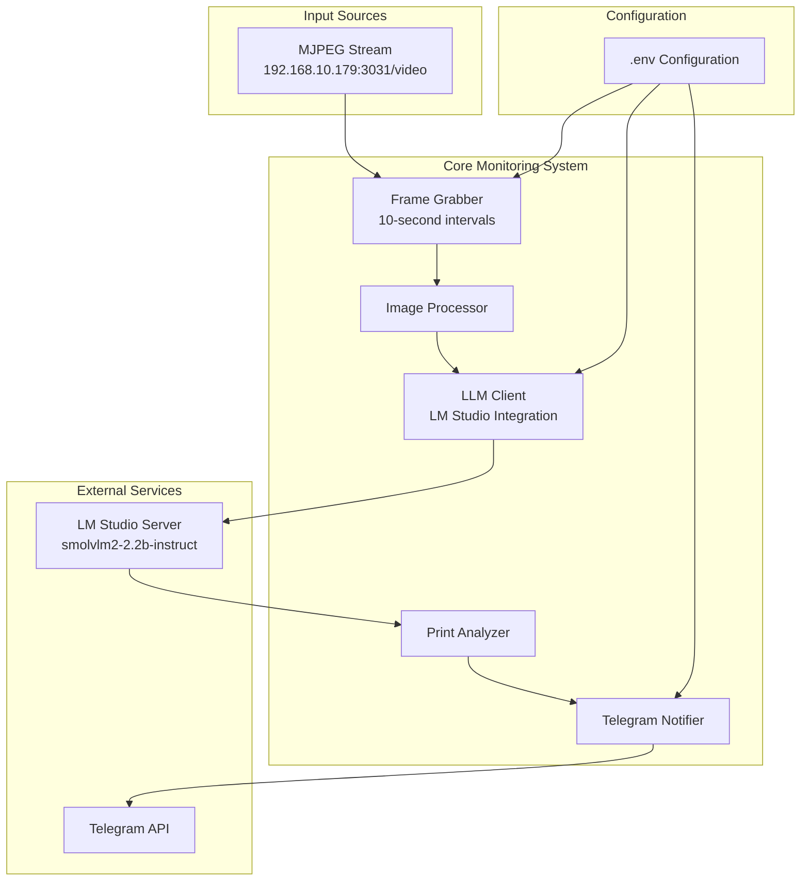

# Elegoo Centauri Carbon Print Monitor - LLM-Based System Design

## Project Overview
A Node.js application that monitors 3D prints in real-time using computer vision and LLM analysis, with automated anomaly detection and Telegram notifications.

## System Architecture



## Core Components

### 1. Frame Capture Module
- **Purpose**: Capture frames from MJPEG stream at configurable intervals
- **Technology**: Node.js with `node-fetch` or `axios` for HTTP streaming
- **Configuration**: Refresh time from `.env` (default: 10 seconds)
- **Output**: JPEG/PNG images for LLM analysis

### 2. LLM Integration Module
- **Purpose**: Communicate with LM Studio's OpenAI-compatible API
- **Model**: smolvlm2-2.2b-instruct (vision language model)
- **API**: OpenAI-compatible endpoints
- **Configuration**:
  - `OPENAI_URL`: LM Studio server URL
  - `OPENAI_TOKEN`: API token (if required)
  - `LLM_MODEL`: Model identifier

### 3. Print Analysis Engine
- **Purpose**: Analyze print images and detect issues
- **Output Structure**:
  ```json
  {
    "objects": [
      {
        "bounding_box": [x1, y1, x2, y2],
        "description": "string",
        "confidence": 0.95
      }
    ],
    "problems": [
      {
        "bounding_box": [x1, y1, x2, y2],
        "issue": "string",
        "reason": "string",
        "confidence": 0.85
      }
    ],
    "overall_status": "good|warning|critical"
  }
  ```

### 4. Notification System
- **Purpose**: Send alerts via Telegram when issues detected
- **Threshold**: Configurable confidence level for notifications
- **Content**: Include image, detected issues, and confidence scores

## Configuration (.env)
```
# Printer Configuration
MJPEG_STREAM_URL=http://192.168.10.179:3031/video
FRAME_CAPTURE_INTERVAL=10

# LLM Configuration
OPENAI_URL=http://localhost:1234/v1
OPENAI_TOKEN=your-lm-studio-token
LLM_MODEL=smolvlm2-2.2b-instruct

# Telegram Configuration
TELEGRAM_BOT_TOKEN=your-bot-token
TELEGRAM_CHAT_ID=your-chat-id
NOTIFICATION_THRESHOLD=0.8

# Application Settings
LOG_LEVEL=info
MAX_RETRIES=3
RETRY_DELAY=5000
```

## Project Structure
```
elegooPrintMon/
├── src/
│   ├── index.js              # Main application entry point
│   ├── config/               # Configuration management
│   │   └── config.js
│   ├── capture/              # Frame capture module
│   │   └── mjpeg-capture.js
│   ├── llm/                  # LLM integration
│   │   ├── llm-client.js
│   │   └── prompts.js
│   ├── analysis/             # Print analysis logic
│   │   └── print-analyzer.js
│   ├── notifications/        # Notification system
│   │   └── telegram-notifier.js
│   └── utils/                # Utilities
│       ├── logger.js
│       └── image-utils.js
├── tests/                    # Test files
├── logs/                     # Application logs
├── .env                      # Environment configuration
├── .env.example              # Example configuration
├── package.json
├── README.md
└── plans/                    # Planning documents
    └── elegoo-print-monitor-plan.md
```

## Dependencies
```json
{
  "dependencies": {
    "axios": "^1.6.0",
    "dotenv": "^16.3.0",
    "node-telegram-bot-api": "^0.64.0",
    "winston": "^3.11.0",
    "sharp": "^0.33.0",
    "openai": "^4.0.0"
  },
  "devDependencies": {
    "nodemon": "^3.0.0",
    "jest": "^29.7.0"
  }
}
```

## Prompt Engineering Strategy

### System Prompt
```
You are a 3D printing expert analyzing print quality from camera images.
Analyze the provided image and identify:
1. Visible objects/components in the print
2. Any potential printing issues or anomalies
3. Provide bounding boxes for each identified item
4. Rate confidence for each detection

Return JSON format with objects and problems arrays.
```

### Response Format
The LLM will be instructed to return structured JSON with:
- Objects array (normal print elements)
- Problems array (issues detected)
- Overall status assessment

## Error Handling & Resilience
1. **Stream Connection Failures**: Exponential backoff retry logic
2. **LLM API Errors**: Fallback to simpler analysis or skip frame
3. **Telegram Failures**: Queue notifications for retry
4. **Image Processing Errors**: Log and continue to next frame

## Monitoring & Logging
- Structured logging with Winston
- Performance metrics (frame capture time, LLM response time)
- Error tracking and alerting
- Periodic health checks

## Next Steps
1. Set up project structure and dependencies
2. Implement core modules sequentially
3. Test with sample images before live stream
4. Integrate with actual printer stream
5. Deploy and monitor performance